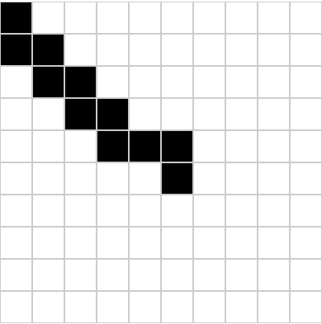

# Grid Line

有时候我们会遇到一些有意思的需求，本示例展示如何通过鼠标事件实现简单的网格绘制。

[在线链接](https://grid-line.vercel.app/)

> 效果图



## 相关技术栈

1. [vite.js](https://vitejs.dev/)
2. [react.js](https://react.dev/)

## 实现思路

最简单的方式当然是通过记录鼠标经过的坐标计算有效网格来实现，
也就是说在每次 `mousemove` 事件回调中计算当前鼠标所在的格子：

```ts
// 一个网格的像素大小
const GRID_SIZE = 40;
// 网格每行/每列的数量
const GRID_COUNT = 10;
// 记录当次鼠标经过的格子
const mousemove = (e: MouseEvent) => {
  const { x, y } = e;
  // 计算当前鼠标所在行
  const row = Math.floor(y / GRID_SIZE);
  // 计算当前鼠标所在列
  const col = Math.floor(x / GRID_SIZE);
  // 计算当前鼠标所在的格子
  const index = col + row * GRID_COUNT;
};
```

这样就可以获取当前鼠标所在的格子，之后我们只需要去重并加入到响应式数据中即可：

```ts
// 记录鼠标经过的格子
const [activeGridSet, setActiveGridSet] = useState(new Set<number>());
// ...
const hash = new Set<number>();
// 记录当次鼠标经过的格子
const mousemove = (e: MouseEvent) => {
  const index = col + row * GRID_COUNT;
  hash.add(index);
  // 更新选中的格子
  setActiveGridSet(new Set(hash));
};
```

数据获取好之后就是事件注册了，
这里我们可以将 `mousemove` 事件于 `mousedown` 的时候全局注入，
并在 `mouseup` 时回以保证数据的唯一性与有效性：

```tsx
const App = () => {
  const startDraw = (e: ReactMouseEvent<HTMLDivElement, MouseEvent>) => {
    // ...
    const mousemove = (e: MouseEvent) => {
      // ...
    };
    // 鼠标抬起时取消全局事件
    const mouseup = () => {
      document.removeEventListener('mousemove', mousemove);
      document.removeEventListener('mouseup', mouseup);
    };
    // 注册全局事件
    document.addEventListener('mousemove', mousemove);
    document.addEventListener('mouseup', mouseup);
  };

  return (
    <SC.Container>
      {/* 从 onMouseDown 触发时开始绘制 */}
      <SC.GridWrapper onMouseDown={startDraw}>{/* ... */}</SC.GridWrapper>
    </SC.Container>
  );
};
```

这样就完成了一个简单的实现，当然我们也可以使用图形学中计算向量与斜率的方式，后续有时间再补充。
